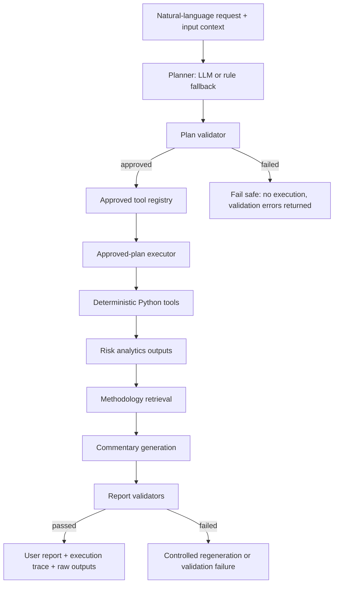

# RiskFlow Agent

Controlled LLM-assisted risk workflow agent for Market Risk, Counterparty Risk, Sensitivity Risk, and Regulatory Risk.

**LLM plans and comments. Python tools calculate. Validators gate execution and output.**

RiskFlow Agent is a prototype AI + Finance engineering demo designed to show controlled agentic workflow orchestration for financial risk analytics. It turns a natural-language request into an approved, auditable risk workflow while keeping risk calculations deterministic and guardrailed.

## Why This Is An Agent

RiskFlow Agent is not a single portfolio VaR script. It separates autonomous planning from controlled execution:

- A planner, rule-based or LLM-backed, proposes a tool sequence from the request and available inputs.
- A plan validator rejects unknown tools, unsupported regulatory-capital tools, and invalid ordering.
- A registered tool layer exposes deterministic capabilities for analytics, retrieval, commentary, and validation.
- An approved-plan executor runs supported tool steps sequentially with explicit context adapters.
- Deterministic Python modules calculate the metrics; the LLM does not invent risk numbers.
- Validators check numerical consistency, methodology grounding, policy guardrails, and unsupported recommendations.
- The run result preserves a user report, execution trace, validation result, and raw analytics outputs.

## Agent Architecture



Canonical package structure:

- `src/core/`: tool registry, tool executor, risk configuration.
- `src/data/`: portfolio parsing, structured file loading, market data.
- `src/workflow/`: planners, plan validation, approved-plan executor, orchestration types.
- `src/market_risk/`: historical market-risk analytics and stress testing.
- `src/credit_risk/`: Counterparty Risk analytics focused on PFE, EPE, netting sets, and limits.
- `src/sensitivity_risk/`: Sensitivity Risk analytics using precomputed Greeks.
- `src/regulatory_risk/`: Regulatory Risk readiness checks for SA-CCR and SIMM / RegIM inputs.
- `src/knowledge/`: local methodology retrieval.
- `src/reporting/`: commentary and report formatting utilities.
- `src/validators/`: numerical, methodology, regulatory, and guardrail validation.

See [docs/architecture.md](docs/architecture.md) for more implementation detail.

## Implemented Workflows

**Market Risk**

- Portfolio metadata: portfolio ID, book, asset classes, risk buckets, region, total notional.
- Annualized volatility.
- Historical VaR and Expected Shortfall.
- Maximum drawdown.
- Dollarized VaR, Expected Shortfall, drawdown, and stress loss when notional is available.
- Deterministic stress testing with simple equity, technology, and rates shocks.

**Counterparty Risk**

- Counterparty exposure profile validation.
- Peak 95% and 99% PFE.
- EPE / average expected exposure.
- Netting set concentration.
- Optional limit utilization by netting set with `PASSED`, `WARNING`, or `BREACHED` status.

**Sensitivity Risk**

- Consumes precomputed Greeks from an upstream pricing or risk engine.
- Validates sensitivity-file schema.
- Aggregates delta, gamma, vega, and theta.
- Identifies largest delta and vega risk-factor concentrations.
- Reports currency consistency warnings when applicable.
- Does not calculate pricing-model Greeks.

**Regulatory Risk**

- SA-CCR and SIMM / RegIM input-completeness checks.
- Distinguishes portfolio-level metadata from missing trade-level SA-CCR inputs.
- Uses supplied sensitivity fields to improve SIMM / RegIM readiness.
- Explicit guardrails prevent fabricated regulatory capital or margin numbers.
- Does not calculate SA-CCR EAD, SIMM margin, or RegIM.

## Quickstart

Install and run tests:

```bash
pip install -e ".[dev]"
pytest -q
```

Run the finalized v1 demo with the deterministic rule planner:

```bash
python examples/run_riskflow_agent_demo.py --planner rule --scenario full --show-plan
```

The same workflow is available through the installed CLI:

```bash
riskflow-agent --planner rule --scenario full --show-plan
```

Run a Market Risk + Sensitivity Risk + Regulatory Risk workflow:

```bash
python examples/run_riskflow_agent_demo.py --planner rule --query "Run market risk, sensitivity risk, and regulatory risk review." --show-plan
```

Run a SIMM readiness workflow using Greeks sensitivities:

```bash
python examples/run_riskflow_agent_demo.py --planner rule --query "Check SIMM readiness using Greeks sensitivities." --show-plan
```

Run failure-case demos:

```bash
python examples/failure_cases/run_invalid_portfolio_demo.py
python examples/failure_cases/run_report_validation_failure_demo.py
```

The primary entry point is `examples/run_riskflow_agent_demo.py`. Older focused demos are archived under `examples/legacy/`; reviewers should use the primary entry point rather than the archived legacy demos.

## CLI Usage

After `pip install -e ".[dev]"`, the console command is:

```bash
riskflow-agent --planner rule --scenario full --show-plan
```

Supported core arguments mirror the primary demo wrapper:

- `--planner auto | llm | rule`
- `--scenario full | market | credit | regulatory`
- `--query "custom request"`
- `--show-plan`
- `--trace-file [path]`

Example:

```bash
riskflow-agent --planner rule --query "Run market risk, sensitivity risk, and regulatory risk review." --show-plan
```

## Use As A Python Library

The public package facade exposes the main workflow entry points:

```python
from riskflow_agent import run_agent_workflow, run_risk_workflow

result = run_agent_workflow(
    query="Run market risk, sensitivity risk, and regulatory risk review.",
    planner_mode="rule",
)

print(result.user_report)
```

## Optional Streamlit UI

RiskFlow Agent also includes a minimal optional Streamlit inspection view:

```bash
pip install -e ".[ui]"
streamlit run apps/streamlit_app.py
```

The UI calls the same `run_agent_workflow()` API as the CLI and Python library. It is an interactive inspection layer over the structured result: executive report, approved plan, validation and guardrails, execution trace, and optional raw outputs. The CLI and Python API remain the canonical reusable interfaces.

## Optional LLM Usage

Planner modes:

- `--planner rule` is the reproducible offline path.
- `--planner auto` uses the LLM planner when an API key is available and falls back clearly to rule planning otherwise.
- `--planner llm` requires an API key and fails safely before execution if the key is unavailable or the LLM response is malformed.
- Commentary also has a deterministic fallback when LLM generation is unavailable.

### LLM Planner Demo

Use `--planner rule` for reproducible offline demos. Use `--planner auto` or `--planner llm` to demonstrate LLM-driven planning when an API key is available:

```bash
python examples/run_riskflow_agent_demo.py --planner auto --query "Run market risk, sensitivity risk, and regulatory risk review." --show-plan
```

Project-root `.env` example:

```text
OPENAI_API_KEY=your_api_key_here
OPENAI_MODEL=gpt-4o-mini
# Optional:
# OPENAI_BASE_URL=https://your-compatible-endpoint/v1
```

Temporary PowerShell setup:

```powershell
$env:OPENAI_API_KEY="your_api_key_here"
$env:OPENAI_MODEL="gpt-4o-mini"
```

Do not commit API keys. `.env` is ignored by `.gitignore`.

## Demo Inputs

The v1 demo uses sample files under `examples/`:

- `sample_portfolio.csv`: institutional-style market holdings with metadata and notional.
- `sample_exposure_profile.csv`: counterparty exposure profile for PFE analytics.
- `sample_sensitivities.csv`: precomputed Greeks for Sensitivity Risk aggregation and SIMM / RegIM readiness.
- `sample_risk_config.json`: fixed market data window, VaR settings, stress scenario, and credit limits.

The market-data lookback window is fixed from `2023-01-01` to `2024-12-31` for more reproducible demo output. Prices are still fetched live, so small data-source revisions may slightly change reported metrics.

## Structured Output

`run_agent_workflow()` returns a structured result with:

- `user_report`: clean user-facing report.
- `execution_trace`: ordered tool execution trace.
- `validation_result`: domain validation and guardrail status.
- `raw_outputs`: underlying analytics outputs.
- `orchestration_trace`: proposed plan, approved plan, selected route, executed tools, skipped tools, and execution mode.

The demo can save trace JSON with `--trace-file`.

## Failure Demos And Guardrails

RiskFlow Agent includes expected failure paths:

- Invalid portfolio weights are rejected before market risk calculation.
- Unsupported or misordered tools are rejected before execution.
- Report validation catches inconsistent commentary, fabricated metrics, and missing assumptions.
- Regulatory readiness reports missing inputs rather than fabricating capital or margin numbers.
- Commentary must not provide investment advice.

## Engineering Highlights

RiskFlow Agent highlights controlled autonomy patterns for financial risk systems:

- The planner provides agentic workflow selection.
- The tool registry defines the allowed action space.
- The executor runs deterministic Python tools, not arbitrary model-generated code.
- Validators act as gates before and after execution.
- The execution trace makes the workflow auditable and reproducible.
- Regulatory Risk workflows are readiness screens only, intentionally avoiding false claims of capital or margin calculation.

This maps well to AI-enabled quant developer work: orchestration, tool use, deterministic analytics, validation guardrails, and explainable risk reporting.

## Scope Boundaries

- No real SA-CCR EAD calculation.
- No real SIMM or RegIM margin calculation.
- No Monte Carlo PFE generation.
- No pricing-model Greeks calculation.
- No production pricing engine.
- No XVA valuation, PD/LGD/EAD modeling, or regulatory capital stack.
- No investment advice.
- No unrestricted autonomous tool execution.
- No production deployment, persistence, or distributed scheduler.

## Next Extensions

- Typed execution graph compiled from the approved plan.
- Richer notional attribution and limit-monitoring views.
- Richer regulatory input schema.
- Optional vector-based methodology retrieval.
- More formal factor exposure and stress scenario libraries.
- PDF or HTML report export.

## Disclaimer

RiskFlow Agent is for analytical demonstration only and does not constitute investment advice.
